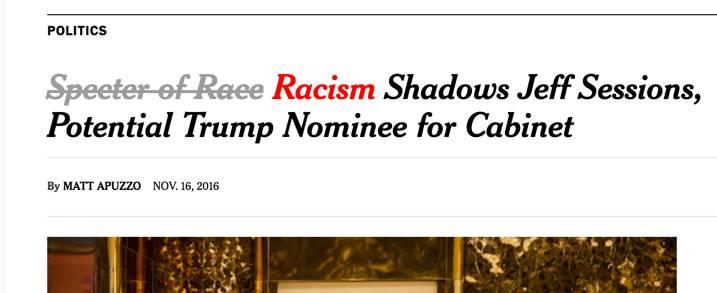
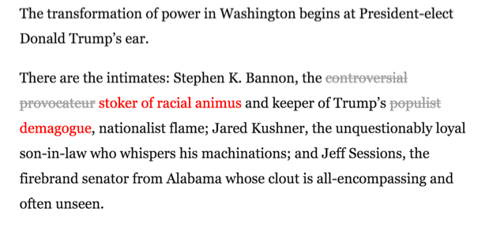

normalization-to-not
=============
Chrome extension that crosses out words that normalizes the Trump presidency and adds their abnormal counterpart.

I'm updating the list of mealy-mouthed-weasel-words whenever I see an instance of it. This extension automatically pulls down the latest list in the background.

### Sample Screenshot

### Sample Screenshot

easy install
===============

[Install from the Chrome Web Store](https://chrome.google.com/webstore/detail/normalization-to-not/pabdfkapjghdhpnlddbjdiphdpbeakab)

what exactly is getting not-normalized
===============
[The extension updates from a copy of this gist](https://gist.github.com/ianfitzpatrick/37c37e32074ff1f648db3a4b77411ddb)

I just sort of update this ad-hoc when I think about it. I'm going to try to leave a comment as I add new phrases, noting where I first saw the phrase in use.

If you think a word belongs on here, please open an issue in github for this project.
